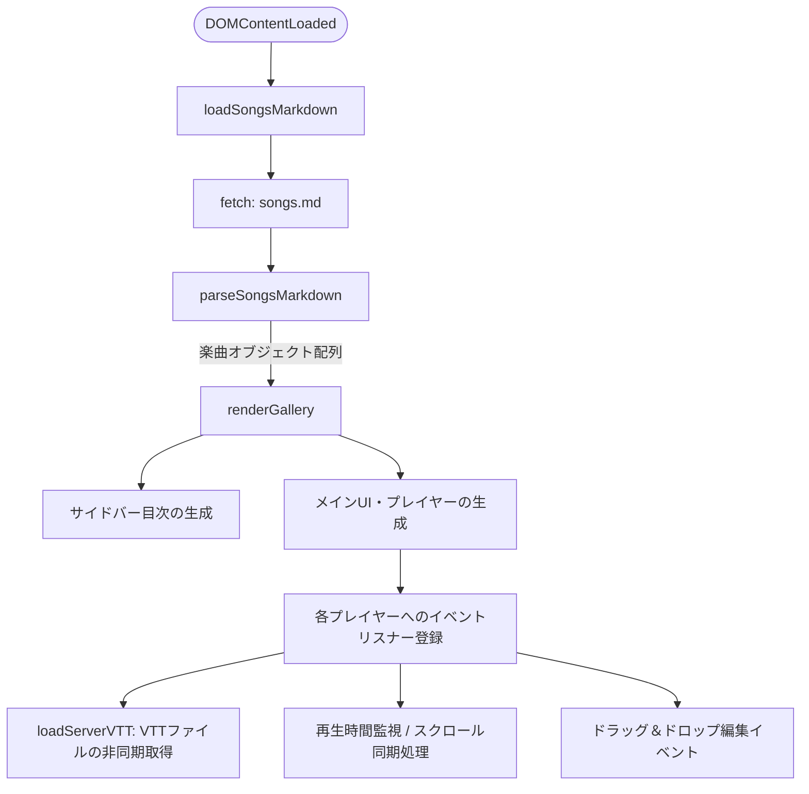
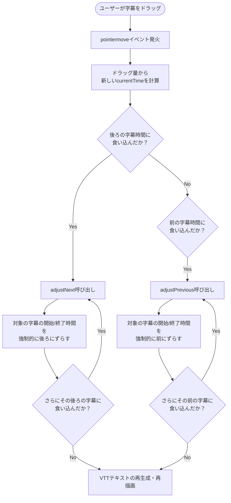

# 🎵 AI-Generated Music: JavaScript 構造・機能解説

このドキュメントでは、`index.html` 内に記述されている主要なJavaScriptの処理フロー、複雑なDOM（HTML要素）の階層構造、および高度な機能（VTT字幕の同期・編集ロジック）について解説します。

---

## 1. 全体の処理フロー

アプリケーション起動時の初期化から、楽曲データの読み込み、画面の構築までの大まかな流れです。



---

## 2. UI・DOM階層構造（プレイヤー領域）

特に構造が複雑な、「VTT編集モード」を内包するプレイヤー領域（`div.player-editor-wrapper`）のDOM階層です。
通常時は左側の `video-wrapper` のみが機能し、編集モードON時に `vtt-editor-panel` などが連動して動作する仕組みになっています。

```mermaid
flowchart TD
    Wrapper[div.player-editor-wrapper]
    
    Wrapper --> VideoWrap[div.video-wrapper\n(動画表示と字幕描画)]
    Wrapper --> EditorPanel[div.vtt-editor-panel\n(編集モード時のみ表示)]
    Wrapper --> HelpPanel[div.vtt-help-panel\n(操作説明)]

    VideoWrap --> Video[videoタグ\n(メインプレイヤー)]
    VideoWrap --> Overlay[div.subtitle-overlay\n(字幕の表示枠 / ドラッグ検知)]
    
    Overlay --> ScrollCont[div.subtitle-scroll-container\n(Y軸移動でスクロール)]
    ScrollCont --> Line1[div.subtitle-line\n(各字幕行のテキスト)]
    ScrollCont --> Line2[div.subtitle-line]
    
    EditorPanel --> Toolbar[div.editor-toolbar\n(コピー/DLボタン)]
    EditorPanel --> Textarea[textarea.vtt-textarea\n(VTTテキスト直編集)]
```

---

## 3. 主要・複雑な関数の解説

### 3.1. `parseSongsMarkdown(mdText)`
* **役割**: `songs.md` のテキストデータを解析し、JavaScriptで扱いやすいオブジェクトの配列に変換します。
* **仕組み**: 
  1. `---` を区切り文字として各楽曲ブロックを分割。
  2. 正規表現を用いてタイトル（`#`）やファイルパス（`File:`）を抽出。
  3. `## English` や `## 日本語訳` といった見出しで区切り、歌詞データを取得します。

### 3.2. `updateScrollForTime(currentTime)`
* **役割**: 動画の現在の再生時間（`currentTime`）に基づき、表示すべき字幕（Cue）を判定してスクロール・ハイライトさせます。
* **仕組み**:
  * `video.addEventListener('timeupdate', ...)` から断続的に呼び出されます。
  * `cues` 配列の中から `start <= currentTime <= end` に当てはまる要素を検索。
  * 該当するインデックスを `updateScroll()` に渡し、`.subtitle-scroll-container` の `translateY`（Y軸方向の位置）をCSSで動的に計算・適用することで、滑らかな縦スクロールを実現します。

---

## 4. 👑 コアロジック: 字幕のドラッグ操作と「玉突き（押しつぶし）」処理

本アプリケーションで最も複雑なのが、**表示されている字幕をマウスでドラッグし、タイムスタンプを調整する機能**です。
字幕の時間を前後にずらした際、**隣接する字幕と時間が重ならないように自動で押し出す（玉突き）処理**を実装しています。

### 関連関数: `adjustNext(idx)` / `adjustPrevious(idx)`



* **再帰処理による連鎖**: `adjustNext` や `adjustPrevious` は、押し出された結果がさらに隣の字幕と干渉する場合、自身を再帰的（リカーシブ）に呼び出すことで、ドミノ倒しのように全体のタイムスタンプを整合性のとれる状態に保ちます。
* **最小表示時間の担保**: `cue.minDuration` によって、押しつぶされすぎた場合でも「最低1秒（または元の表示時間）」の長さは確保されるように制御されています。
